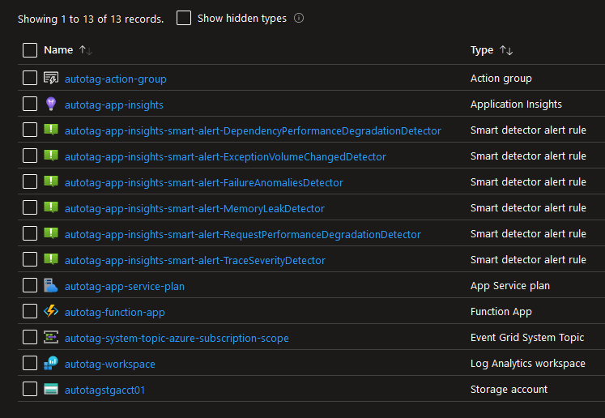

# Azure Auto Tag

Terraform deployment of an Azure Function App which will apply tags to newly created resources with creator and when created tags.  It must be deployed per subscription as management groups cannot be assigned event topic subscriptions.

I've seen a few other autotag examples in the wild but none of them are using terraform, so let's fix that...



## Auto Tag Format

The function app will add two new tags to resources when they are created

```
    Name                 Value                                                     
    ===================  ==========================================================
    autotag-createdBy    svc-terraform;appID=12345678-4444-3333-2222-111111111111
    autotag-createdDate  2023-11-29T03:35:24Z   
```

### autotag-createdBy


Service Principal Value Format
* `<service account display name (null if can't be discovered)>;appID=<service principal application ID>`

Standard User Value Format
* `<user display name>;<user email address>`

### autotag-createdDate

UTC time stamp of when the resource was created

## Notes

* Azure management groups cannot be assigned event subscriptions so each subscription needs its own autotag deployment
    * keep in mind the global unique name requirements for storage accounts and function app names
* The function will ignore itself writing tags to new resources since technically that is also a `Microsoft.Resources.ResourceWriteSuccess` event
* Only a single subscription level event topic can exist so no prod/dev setup - DO IT LIVE!
* The powershell function contains several regex variables that can be used to skip resources that do not support tags
* Powershell modules must be explicitly enabled in requirements.psd1, which is uploaded via FTPS using local-exec
* When app insights are linked to the function app Azure creates hidden links, those are ignored in lifecycle and shouldn't be removed
* Function app needs to be publicly accessible
* The function app Managed System Identity (MSI) must have directory.read.all permissions to resolve service principal IDs to display name
* All alerts and smart detector alerts are disabled by default but can be granularly enabled as needed

## Deployment

### Prequisites
1) Azure tenant and subscription
1) Azure service principal with the following API permissions
    * AppRoleAssignment.ReadWrite.All - assign Directory.Read.All API permissions to Function App Managed System Identity so it can resolve service principal display names
    * Directory.Read.All - get details of the newly created Function App Managed System Identity
1) Azure service principal with the following RBAC permissions on subscription
    * Preferred - Owner Role + constrained to assign "Tag Contributor" permission only
    * Excessive - `Microsoft.Authorization/roleAssignments/write` permission
1) Azure storage account for tfstate file 
    * Service principal must have r/w access
1) Powershell 7.x (Windows or Linux)
1) Powershell Modules
    * Az - https://learn.microsoft.com/en-us/powershell/azure/install-azure-powershell?view=azps-11.0.0
    * Microsoft.Graph - https://learn.microsoft.com/en-us/powershell/microsoftgraph/installation?view=graph-powershell-1.0#installation
1) Terraform 1.6.4 or greater

### Prep
1) Start Powershell 7
    * windows: start new standalone terminal or within VS Code
    * linux: run pwsh
1) Clone repository locally, change directory to repo root
1) Rename `az.env.secrets.template` to `az.env.secrets`
    1) Update all secrets
1) Rename `vars.auto.tfvars.template` to `vars.auto.tfvars`
    1) Update variables
1) Import environment variables
    * `import-csv *.env.secrets | ? {$_.name -notmatch '^#|^$'} | % {"Add env var $($_.name)"; New-Item -Name $_.name -Value $_.value -Path "env:\" -force | out-null}`

### Terraform
1) Use Powershell session from prep section
    * You should be in the root of the repo and env vars set
1) Run `. ./!init.ps1` to initialize TF state
    * Linux: you may need to escape exclamation point with a backslash
1) Run `terraform plan` and review output
1) Run `terraform apply`
1) Validate resource creation
1) Create new resource group and verify auto tag
1) Update existing terraform lifecycle blocks to ignore the new autotags
    ```
    lifecycle {
      ignore_changes = [
        tags["autotag-createdBy"],
        tags["autotag-createdDate"]
      ]
    }
    ```

## Troubleshooting

### Tags not being created

1) Open the autotag function app
1) Select the autotag-function
1) Select Monitor
1) Select Logs
1) Change log location from App Insights to File System to get a live stream of function activity

### Default Action Group Appears

https://github.com/hashicorp/terraform-provider-azurerm/issues/16124

This default group is created by Azure Monitor and the Azure Smart Alert Application.  It can prevent `terraform destroy` from completing as the resource is not tracked.

1) Use `prevent_deletion_if_contains_resources = false` in the azurerm provider features block

    -OR-

1) Setup a task to delete the resource
    ```PowerShell
    Write-Host "`nClean up the default action group resource that will prevent terraform destroy from completing"
    Get-AzResource -ResourceGroupName $appResourceGroupName -ResourceName 'Application Insights Smart Detection' | Remove-AzResource -Verbose -Force
    ```

### Selecting Monitor in autotag-function shows App Insights are not setup

I've seen this a few times but only during the first time I look at a newly created autotag-funciton

1) Open the autotag function app
1) Select the autotag-function
1) Select Monitor
    * The console may display text asking you to enable App Insights
1) Select Code + Test
1) Go back to Monitor and it should display as expected

<br>
<br>

# Terraform Module

<!-- BEGIN_TF_DOCS -->
## Requirements

| Name | Version |
|------|---------|
| <a name="requirement_terraform"></a> [terraform](#requirement\_terraform) | >=1.6.4 |
| <a name="requirement_azuread"></a> [azuread](#requirement\_azuread) | >=2.46.0 |
| <a name="requirement_azurerm"></a> [azurerm](#requirement\_azurerm) | >=3.81.0 |
| <a name="requirement_local"></a> [local](#requirement\_local) | >=2.4.0 |

## Providers

| Name | Version |
|------|---------|
| <a name="provider_azurerm"></a> [azurerm](#provider\_azurerm) | 3.82.0 |
| <a name="provider_local"></a> [local](#provider\_local) | 2.4.0 |

## Modules

No modules.

## Resources

| Name | Type |
|------|------|
| [azurerm_application_insights.autotag](https://registry.terraform.io/providers/hashicorp/azurerm/latest/docs/resources/application_insights) | resource |
| [azurerm_application_insights_smart_detection_rule.autotag](https://registry.terraform.io/providers/hashicorp/azurerm/latest/docs/resources/application_insights_smart_detection_rule) | resource |
| [azurerm_eventgrid_system_topic.autotag_azure_subscription_scope](https://registry.terraform.io/providers/hashicorp/azurerm/latest/docs/resources/eventgrid_system_topic) | resource |
| [azurerm_eventgrid_system_topic_event_subscription.autotag](https://registry.terraform.io/providers/hashicorp/azurerm/latest/docs/resources/eventgrid_system_topic_event_subscription) | resource |
| [azurerm_function_app_function.autotag](https://registry.terraform.io/providers/hashicorp/azurerm/latest/docs/resources/function_app_function) | resource |
| [azurerm_log_analytics_workspace.autotag](https://registry.terraform.io/providers/hashicorp/azurerm/latest/docs/resources/log_analytics_workspace) | resource |
| [azurerm_monitor_action_group.autotag](https://registry.terraform.io/providers/hashicorp/azurerm/latest/docs/resources/monitor_action_group) | resource |
| [azurerm_monitor_smart_detector_alert_rule.autotag](https://registry.terraform.io/providers/hashicorp/azurerm/latest/docs/resources/monitor_smart_detector_alert_rule) | resource |
| [azurerm_resource_group.autotag](https://registry.terraform.io/providers/hashicorp/azurerm/latest/docs/resources/resource_group) | resource |
| [azurerm_role_assignment.autotag_tag_contributor_azure_subscription_scope](https://registry.terraform.io/providers/hashicorp/azurerm/latest/docs/resources/role_assignment) | resource |
| [azurerm_service_plan.autotag](https://registry.terraform.io/providers/hashicorp/azurerm/latest/docs/resources/service_plan) | resource |
| [azurerm_storage_account.autotag](https://registry.terraform.io/providers/hashicorp/azurerm/latest/docs/resources/storage_account) | resource |
| [azurerm_windows_function_app.autotag](https://registry.terraform.io/providers/hashicorp/azurerm/latest/docs/resources/windows_function_app) | resource |
| [local_file.autotag_powershell_module_requirements](https://registry.terraform.io/providers/hashicorp/local/latest/docs/resources/file) | resource |
| [azurerm_subscription.autotag_target](https://registry.terraform.io/providers/hashicorp/azurerm/latest/docs/data-sources/subscription) | data source |

## Inputs

| Name | Description | Type | Default | Required |
|------|-------------|------|---------|:--------:|
| <a name="input_app_insights_action_group_rules"></a> [app\_insights\_action\_group\_rules](#input\_app\_insights\_action\_group\_rules) | app insights smart detection rules | `map` | <pre>{<br>  "DependencyPerformanceDegradationDetector": {<br>    "enabled": false,<br>    "frequency": "P1D",<br>    "severity": "Sev3"<br>  },<br>  "ExceptionVolumeChangedDetector": {<br>    "enabled": false,<br>    "frequency": "P1D",<br>    "severity": "Sev3"<br>  },<br>  "FailureAnomaliesDetector": {<br>    "enabled": false,<br>    "frequency": "PT1M",<br>    "severity": "Sev3"<br>  },<br>  "MemoryLeakDetector": {<br>    "enabled": false,<br>    "frequency": "P1D",<br>    "severity": "Sev3"<br>  },<br>  "RequestPerformanceDegradationDetector": {<br>    "enabled": false,<br>    "frequency": "P1D",<br>    "severity": "Sev3"<br>  },<br>  "TraceSeverityDetector": {<br>    "enabled": false,<br>    "frequency": "P1D",<br>    "severity": "Sev3"<br>  }<br>}</pre> | no |
| <a name="input_app_insights_daily_data_cap_gb"></a> [app\_insights\_daily\_data\_cap\_gb](#input\_app\_insights\_daily\_data\_cap\_gb) | app insights max daily data cap in GB | `number` | `5` | no |
| <a name="input_app_insights_detection_rules"></a> [app\_insights\_detection\_rules](#input\_app\_insights\_detection\_rules) | app insights detection rules | `map` | <pre>{<br>  "Abnormal rise in daily data volume": false,<br>  "Abnormal rise in exception volume": false,<br>  "Degradation in dependency duration": false,<br>  "Degradation in server response time": false,<br>  "Degradation in trace severity ratio": false,<br>  "Long dependency duration": false,<br>  "Potential memory leak detected": false,<br>  "Potential security issue detected": false,<br>  "Slow page load time": false,<br>  "Slow server response time": false<br>}</pre> | no |
| <a name="input_app_insights_retention_days"></a> [app\_insights\_retention\_days](#input\_app\_insights\_retention\_days) | app insights retention days | `number` | `30` | no |
| <a name="input_app_service_plan_sku"></a> [app\_service\_plan\_sku](#input\_app\_service\_plan\_sku) | default to consumption plan | `string` | `"Y1"` | no |
| <a name="input_autotag_resource_prefix"></a> [autotag\_resource\_prefix](#input\_autotag\_resource\_prefix) | prefix for autotag resources, must be alphanumeric only to conform with storage account naming restrictions | `string` | n/a | yes |
| <a name="input_azure_subscription_id"></a> [azure\_subscription\_id](#input\_azure\_subscription\_id) | azure subscription to monitor for write events | `string` | n/a | yes |
| <a name="input_function_app_name_suffix"></a> [function\_app\_name\_suffix](#input\_function\_app\_name\_suffix) | function app name needs to be globally unique, will be prefixed by autotag\_resource\_prefix | `string` | n/a | yes |
| <a name="input_function_app_powershell_modules"></a> [function\_app\_powershell\_modules](#input\_function\_app\_powershell\_modules) | function app required powershell modules | `string` | `"@{\r\n    'Az.Accounts' = '2.*'\r\n    'Az.Resources' = '6.*'\r\n}\r\n"` | no |
| <a name="input_function_app_powershell_version"></a> [function\_app\_powershell\_version](#input\_function\_app\_powershell\_version) | function app powershell version | `string` | `"7.2"` | no |
| <a name="input_function_app_version"></a> [function\_app\_version](#input\_function\_app\_version) | function app version | `string` | `"~4"` | no |
| <a name="input_log_analytics_sku"></a> [log\_analytics\_sku](#input\_log\_analytics\_sku) | review terraform documentation if changing to Free tier, has quota size impacts | `string` | `"PerGB2018"` | no |
| <a name="input_resource_group_location"></a> [resource\_group\_location](#input\_resource\_group\_location) | resource group location | `string` | n/a | yes |
| <a name="input_resource_group_name"></a> [resource\_group\_name](#input\_resource\_group\_name) | resource group name | `string` | n/a | yes |
| <a name="input_storage_account_name_suffix"></a> [storage\_account\_name\_suffix](#input\_storage\_account\_name\_suffix) | storage account name needs to be globally unique, will be prefixed by autotag\_resource\_prefix | `string` | n/a | yes |
| <a name="input_storage_replication"></a> [storage\_replication](#input\_storage\_replication) | azure storage account replication type | `string` | `"LRS"` | no |
| <a name="input_storage_tier"></a> [storage\_tier](#input\_storage\_tier) | azure storage account tier | `string` | `"Standard"` | no |

## Outputs

| Name | Description |
|------|-------------|
| <a name="output_autotag_deployment_details"></a> [autotag\_deployment\_details](#output\_autotag\_deployment\_details) | various details about the deployed autotag resources |
<!-- END_TF_DOCS -->